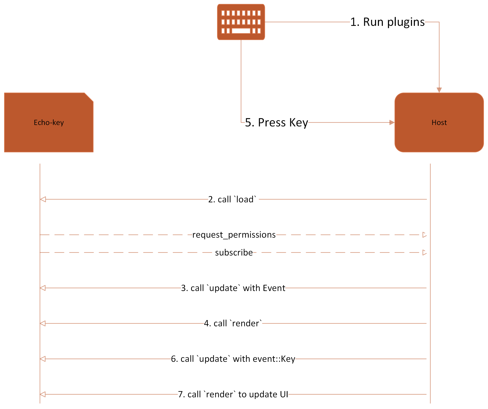

# Zellij Plugin: Key Stroke Echoer

## Overview
This Zellij plugin captures and echoes keyboard key strokes in the terminal. It also monitors the number of times it renders content on the terminal, providing information on why a render was triggered.

## Key Features
- Echoes Key Strokes: The plugin captures and displays each key pressed by the user.
- Render Counting: Tracks and displays how many times the plugin's content is rendered.
- Event Monitoring: Informs what type of event—either a key stroke or mode update—triggered the last render.

## Internal State
The plugin maintains an internal state with three main components:

1. key_strokes: Stores the history of key strokes.
2. counter: Counts the number of rendering operations.
3. render_event: Identifies the last event that caused a render.


## Initialization (load Method)
This function is called when the plugin is initially loaded, request permission, Subscribes interested event and other setup should be here.
For our sample - On load, the plugin:

- Requests permission to read the application state from Zellij.
- Subscribes to Key and ModeUpdate events.

> Event key does not really need permission, but `ModeUpdate` relies on `ReadAppliationState`

## Event Handling (update Method)
This function is called when a subscribed event occurs, and this function returns true if it needs to trigger a render, indicated by the render flag.

For our sample:

- Updates the key_strokes if a key is pressed.
- Updates the render_event to indicate what type of event was last received.

## Rendering (render Method)
This function is responsible for rendering content:

- Increments the render counter.
- Outputs the last key stroke and reason for rendering to the terminal.

---

# How to use

This sample plugin provides a `my.kdl`, the only difference from the zellij default config is a keybinding `Ctrl t t` to render our plugin


```
     bind "t" {
           LaunchOrFocusPlugin "file:[absolute-path]/my-first-zellij-plugin.wasm" {
               floating true
               move_to_focused_tab true
           };
           SwitchToMode "Normal"
       }
```

Change the file path from your local, and run `zellij -c <path-to>\my.kdl`
