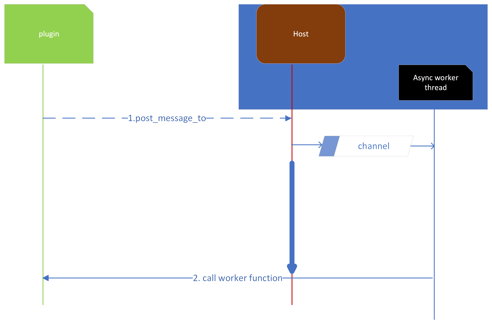

## Why worker?
Every zellij plugin is compiled into WASM, and WASI doesn't provide native support for multi-threading or asynchronous I/O.

- Blocking the Main Thread: If you perform a long-running operation like scanning a disk within a function in your WASI module, it will block the main thread, potentially leading to poor system responsiveness.

- Lack of Asynchronous APIs: WASI has not provided asynchronous APIs or native thread support, so you can't easily offload the task to another thread.

- Resource Limitation: WebAssembly modules run in a constrained environment, which might have limited access to system resources.

## What does zellij do differently?

zellij worker is essentially a thread to take care a long-run job. In zellij server, it starts off a channel and move receiver to a new thread(this is a common sense in zellij code)

